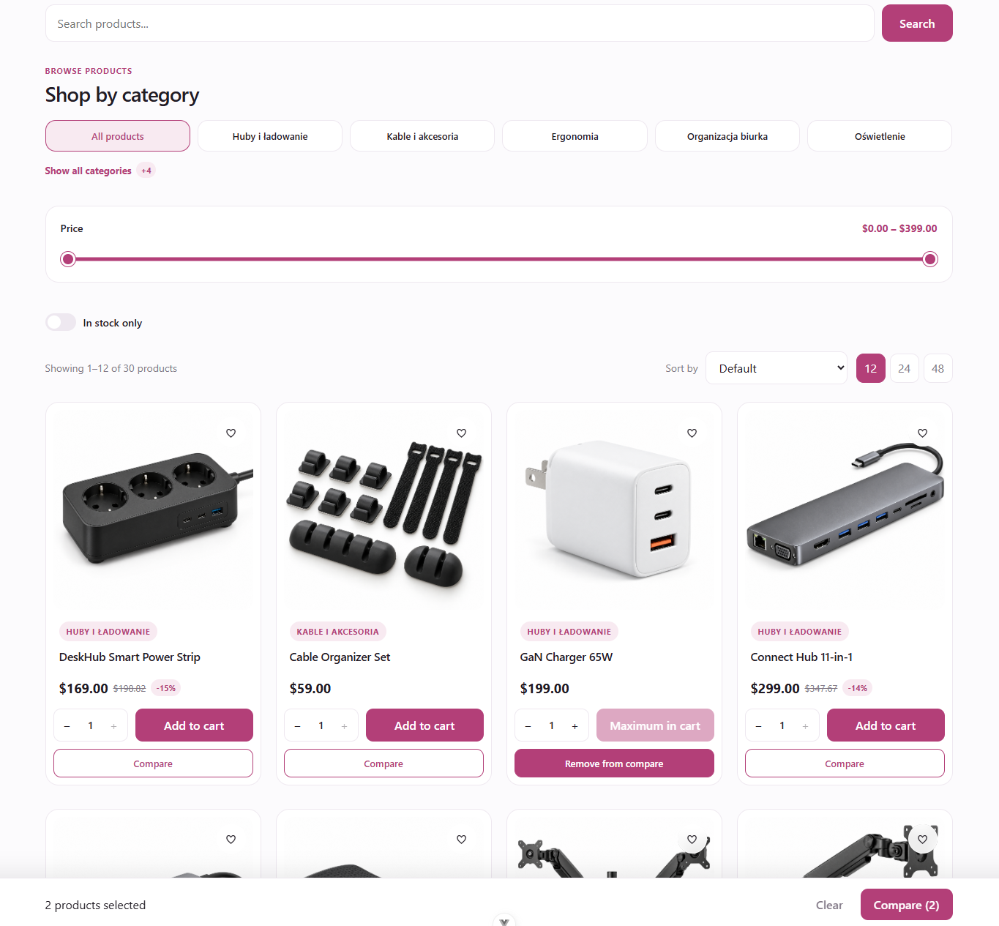

# Product Catalog

A responsive e-commerce application built with Vue 3 and Vite.

The project focuses on a complete shopping flow and integration with WooCommerce Store API, including variable products, product availability, cart management, checkout and local order history.

## Preview



## Features

- Product catalog loaded from WooCommerce Store API
- Variable WooCommerce products
- Variation price handling
- Variation stock status
- Variation-specific images
- Product search with suggestions and recent searches
- Category filtering
- Price range filtering
- Stock filtering
- Product sorting
- Pagination
- Product details page
- Product image gallery and lightbox
- Related products
- Recently viewed products
- Favorites
- Product comparison
- Shopping cart
- Mini cart
- Separate cart items for product variations
- Persistent cart with localStorage
- Free shipping progress indicator
- Multi-step checkout
- Delivery method selection
- Payment method selection
- Coupon codes
- Order confirmation
- Order history
- Order details
- Order status management
- Loading skeletons
- Error states
- Custom 404 page
- Responsive layout

## WooCommerce Integration

The application is connected locally to a WordPress installation with WooCommerce.

Product data is loaded through the WooCommerce Store API:

```text
/wp-json/wc/store/v1/products
```

The service layer normalizes WooCommerce data before it is used by Vue components.

Variable products are supported, including:

- variation-specific prices
- regular and sale prices
- stock availability
- variation images
- variation labels
- separate cart items for each variation

The local Vite development server proxies WooCommerce API requests to the WordPress installation.

## Tech Stack

- Vue 3
- Composition API
- Vue Router
- Vite
- JavaScript
- CSS
- WordPress
- WooCommerce Store API
- Local Storage
- vue-easy-lightbox
- ESLint
- Oxlint
- Prettier

## Project Structure

```text
src/
├── components/
├── composables/
├── directives/
├── services/
├── utils/
├── views/
├── router/
├── App.vue
└── main.js
```

The application separates responsibilities between:

- `components` – reusable UI components
- `views` – route-level pages
- `composables` – reusable state and business logic
- `services` – API communication and data normalization
- `utils` – shared helper functions
- `directives` – custom Vue directives

## State Management

The project uses Vue Composition API and reusable composables instead of an external state management library.

Shared application state includes:

- cart
- favorites
- product comparison
- recently viewed products
- orders

Selected data is persisted in `localStorage`, allowing it to survive page refreshes.

## Getting Started

Install dependencies:

```sh
npm install
```

Start the development server:

```sh
npm run dev
```

Create a production build:

```sh
npm run build
```

Preview the production build:

```sh
npm run preview
```

## Code Quality

Run linting:

```sh
npm run lint
```

Format source files:

```sh
npm run format
```

## Purpose

This project was created to practice building a larger Vue application and integrating a Vue frontend with WooCommerce.

The main focus is on reusable components, composables, routing, API normalization, variable products, persistent client-side state and a complete e-commerce flow.
